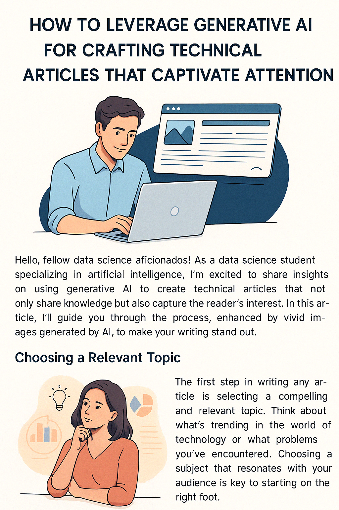

# Projeto: Gerando Artigos Técnicos com IA 🧠✍️

## 📒 Descrição
Este repositório faz parte do desafio da DIO com o objetivo de explorar o uso de **IA Generativa** na produção de **conteúdo técnico de qualidade**. Como estudante de Ciência de Dados, estou cada vez mais mergulhado no universo das inteligências artificiais e acredito que compartilhar conhecimento é uma das formas mais poderosas de consolidar aprendizados e criar autoridade na área.

Neste projeto, usei prompts otimizados no **ChatGPT** para criar um artigo magnético e bem estruturado, com apoio visual gerado por IA através da plataforma **Lexica.art**. Aqui você encontra:
- O **artigo completo** gerado com IA;
- Os **prompts utilizados**;
- As **imagens criadas com IA**;
- Um modelo replicável para futuras publicações.

## 🧠 Tema do Artigo
**"Como a Inteligência Artificial está Transformando a Carreira dos Cientistas de Dados"**

## 📰 Headline
> *Descubra como ferramentas de IA estão acelerando processos, otimizando modelos e mudando a forma como cientistas de dados trabalham (e pensam).* 🔍

## 📄 Artigo Completo

### Introdução
Nos últimos anos, a Inteligência Artificial (IA) deixou de ser apenas uma promessa futurista para se tornar uma aliada indispensável no cotidiano de muitos profissionais — especialmente os cientistas de dados. Ferramentas baseadas em IA estão otimizando fluxos de trabalho, automatizando tarefas repetitivas e até sugerindo soluções criativas para problemas complexos.

### Ferramentas que Estão Fazendo a Diferença
Hoje, ferramentas como **ChatGPT**, **GitHub Copilot**, **Lexica.art** e **AutoML** estão mudando drasticamente a forma como operamos em projetos de dados. Com elas, é possível gerar códigos, revisar pipelines, documentar experimentos e até criar apresentações visuais com apenas alguns comandos bem elaborados (prompts).

### Um Novo Perfil Profissional
O cientista de dados de hoje já não é apenas um analista técnico. Ele é, também, um bom engenheiro de prompts. Saber conversar com um modelo de linguagem, entender suas limitações e aproveitar ao máximo seu potencial virou habilidade essencial no portfólio de quem quer se destacar no mercado.

### Na Prática
Como estudante de Ciência de Dados, tenho incorporado IAs generativas no meu dia a dia. Utilizo o ChatGPT para revisar conceitos, gerar explicações e até estruturar projetos. Já usei o Lexica.art para criar imagens que ilustram apresentações e relatórios. Essas ferramentas não substituem meu raciocínio — elas o potencializam.

### Conclusão
A IA não veio para substituir o cientista de dados, mas para amplificar suas capacidades. O segredo está em saber como utilizar essas ferramentas de forma estratégica e consciente.

> **Call to Action:** Se você ainda não está explorando o uso da IA na sua jornada de aprendizado ou no seu trabalho, comece hoje mesmo. O futuro já está aqui.

## 🖼️ Imagens Geradas
As imagens foram criadas com IA no site **[Lexica.art](https://lexica.art)** para ilustrar os principais pontos do artigo.

## 💬 Prompts Utilizados
Todos os prompts utilizados estão documentados no arquivo [`prompts-utilizados.md`](./prompts-utilizados.md), incluindo aqueles para texto, estrutura de artigo e geração de imagens.

## 🔗 Link do Artigo
[Leia o artigo completo aqui](https://seuartigo.medium.com) *(substitua com o link real assim que publicar)*

## 🌐 Referências
- [Repositório base do desafio - Felipe Aguiar](https://github.com/felipeAguiarCode/prompts-for-article-generate-by-ia)
- [Ferramenta de geração de imagem com IA - Lexica.art](https://lexica.art)

---

> "Não basta usar IA. Entenda, explore e compartilhe. É assim que construímos autoridade."

Feito com curiosidade e café ☕ por um estudante que ama dados e acredita no futuro com IA. #IAnoGitHub
