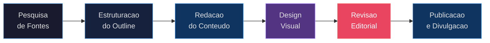
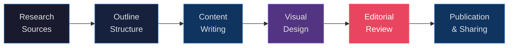

# Artigo Tecnico: Como a Ciencia de Dados Esta Transformando Carreiras

<div align="center">


**PT-BR** | [**English**](#english-version)

</div>

---

## Descricao

Repositorio de documentacao de um artigo tecnico autoral sobre o impacto da Ciencia de Dados na transformacao de carreiras no mercado atual. O artigo foi estruturado, pesquisado e redigido como exercicio de escrita tecnica, com foco em clareza, rigor conceitual e aplicabilidade pratica para profissionais e estudantes da area.

O objetivo e demonstrar como articular conhecimento tecnico complexo em linguagem acessivel, com uma narrativa coerente do tema: a evolucao do perfil profissional do cientista de dados.

---

## Fluxo de Criacao do Artigo



---

## Tema do Artigo

**"Como a Inteligencia Artificial Esta Transformando a Carreira dos Cientistas de Dados"**

> *Descubra como novas ferramentas e metodologias estao acelerando processos, otimizando modelos e mudando a forma como cientistas de dados trabalham — e pensam.*

---

## Artigo Completo

### Introducao

Nos ultimos anos, a Inteligencia Artificial deixou de ser apenas uma promessa futurista para se tornar uma aliada indispensavel no cotidiano de muitos profissionais — especialmente os cientistas de dados. Ferramentas baseadas em aprendizado de maquina e automacao estao otimizando fluxos de trabalho, eliminando tarefas repetitivas de baixo valor e abrindo espaco para que o profissional se concentre no que realmente importa: interpretar dados e gerar valor estrategico.

A transformacao nao e apenas tecnologica. E cultural. O mercado passou a exigir cientistas de dados capazes de transitar entre dominios distintos — estatistica, engenharia de software, comunicacao e pensamento critico — e de se adaptar rapidamente a novas ferramentas e paradigmas.

---

### Ferramentas que Estao Fazendo a Diferenca

O ecossistema de ferramentas disponiveis para cientistas de dados cresceu de forma exponencial. Plataformas de AutoML, bibliotecas de visualizacao interativa, frameworks de MLOps e ambientes colaborativos de notebooks transformaram a maneira como projetos de dados sao concebidos, executados e entregues.

Com essas tecnologias, e possivel:

- **Automatizar pipelines de dados** de ponta a ponta, desde a ingestao ate a entrega em producao;
- **Revisar e documentar experimentos** de forma sistematica, garantindo rastreabilidade e reproducibilidade;
- **Gerar visualizacoes dinamicas** que comunicam resultados complexos de forma clara para stakeholders nao tecnicos;
- **Prototipar modelos** em fracao do tempo que exigiria abordagens tradicionais.

O diferencial competitive hoje nao esta apenas em conhecer os algoritmos — esta em saber orquestrar o ecossistema de ferramentas de forma eficiente.

---

### Um Novo Perfil Profissional

O cientista de dados de hoje e um profissional multidimensional. Alem do dominio tecnico em estatistica, machine learning e programacao, o mercado passou a valorizar habilidades que antes eram consideradas secundarias:

| Habilidade | Por que importa |
|---|---|
| Comunicacao de dados | Transformar insights em decisoes requer clareza narrativa |
| Pensamento critico | Questionar suposicoes previne modelos enviesados |
| Colaboracao interdisciplinar | Projetos de dados envolvem areas de negocio, TI e produto |
| Aprendizado continuo | O campo evolui em ritmo acelerado e exige atualizacao constante |
| Etica em dados | Privacidade, vieses e responsabilidade sao temas centrais |

Esse perfil expandido nao e uma ameaca ao tecnico especialista — e uma evolucao natural. O profissional que desenvolve tanto profundidade quanto amplitude se torna capaz de liderar iniciativas de dados de maior impacto.

---

### Na Pratica

Como estudante de Ciencia de Dados, tenho observado essa transformacao de perto — e vivenciado em projetos pessoais e academicos. A jornada de aprendizado mudou: nao se aprende mais de forma linear, seguindo curriculos fixos. Aprende-se construindo, errando, iterando.

Alguns aprendizados concretos dessa jornada:

1. **Projetos reais ensinam mais que exercicios isolados.** Trabalhar com dados messy, deadlines e stakeholders ficticiamente simulados e muito mais revelador do que tutoriais curados.

2. **A documentacao e tao importante quanto o codigo.** Um modelo que nao pode ser explicado ou reproduzido tem valor limitado. Escrever tecnicamente e uma habilidade que precisa ser desenvolvida com intencionalidade.

3. **O portfolio conta a historia do profissional.** Cada repositorio, cada artigo, cada apresentacao e uma evidencia tangivel de competencia — e de como o profissional pensa e resolve problemas.

4. **Comunidade acelera o aprendizado.** Engajar com outras pessoas da area, publicar conteudo e receber feedback cria ciclos virtuosos de evolucao.

---

### Conclusao

A Ciencia de Dados nao esta apenas transformando industrias — esta transformando o que significa ser um profissional do seculo XXI. O campo exige constante reinvencao, e quem abraca essa dinamica com curiosidade e disciplina tem diante de si uma carreira de enorme potencial.

A IA nao veio para substituir o cientista de dados, mas para amplificar suas capacidades. O segredo esta em desenvolver uma relacao estrategica com as ferramentas disponives: entender o que elas fazem bem, onde seus limites estao e como combina-las com o julgamento humano insubstituivel.

> **Call to Action:** Se voce ainda nao esta investindo em escrita tecnica como parte do seu desenvolvimento profissional, comece agora. Articular conhecimento e uma das formas mais poderosas de consolida-lo — e de criar autoridade na area.

---

## Estrutura do Repositorio

```
Criando-Artigos-Tecnicos-com-ChatGPT-e-Lexica.art/
├── README.md                   # Este arquivo — documentacao principal
├── README-Artigo-IA.md         # Versao alternativa do artigo
├── imagens/                    # Assets visuais do artigo
│   └── *.png
├── LICENSE                     # Licenca MIT
└── *.png                       # Imagens de capa e ilustracoes
```

---

## Competencias Demonstradas

- Estruturacao de artigo tecnico com introducao, desenvolvimento e conclusao
- Pesquisa e sintese de tendencias em Ciencia de Dados
- Escrita tecnica acessivel para multiplos niveis de leitores
- Design de fluxo editorial para producao de conteudo
- Documentacao profissional em Markdown com diagramas Mermaid

---

---

<a name="english-version"></a>

# Technical Article: How Data Science Is Transforming Careers

<div align="center">

**[PT-BR](#artigo-tecnico-como-a-ciencia-de-dados-esta-transformando-carreiras)** | **English**

</div>

---

## Description

Documentation repository for an original technical article on the impact of Data Science on career transformation in today's market. The article was structured, researched, and written as a technical writing exercise, focused on clarity, conceptual rigor, and practical applicability for professionals and students in the field.

The goal is to demonstrate how to articulate complex technical knowledge in accessible language, with a coherent narrative around the theme: the evolution of the data scientist's professional profile.

---

## Article Creation Workflow



---

## Article Theme

**"How Artificial Intelligence Is Transforming the Career of Data Scientists"**

> *Discover how new tools and methodologies are accelerating processes, optimizing models, and changing the way data scientists work — and think.*

---

## Full Article

### Introduction

In recent years, Artificial Intelligence has moved beyond being a futuristic promise to become an indispensable ally in the daily lives of many professionals — especially data scientists. Tools based on machine learning and automation are optimizing workflows, eliminating low-value repetitive tasks, and creating space for professionals to focus on what truly matters: interpreting data and generating strategic value.

The transformation is not just technological. It is cultural. The market now demands data scientists capable of navigating distinct domains — statistics, software engineering, communication, and critical thinking — and of rapidly adapting to new tools and paradigms.

---

### Tools Making a Difference

The ecosystem of tools available to data scientists has grown exponentially. AutoML platforms, interactive visualization libraries, MLOps frameworks, and collaborative notebook environments have transformed how data projects are conceived, executed, and delivered.

With these technologies, it is possible to:

- **Automate end-to-end data pipelines**, from ingestion to production delivery;
- **Review and document experiments** systematically, ensuring traceability and reproducibility;
- **Generate dynamic visualizations** that communicate complex results clearly to non-technical stakeholders;
- **Prototype models** in a fraction of the time traditional approaches would require.

The competitive differentiator today lies not only in knowing the algorithms — it lies in knowing how to orchestrate the tool ecosystem efficiently.

---

### A New Professional Profile

Today's data scientist is a multidimensional professional. Beyond technical mastery in statistics, machine learning, and programming, the market has come to value skills once considered secondary:

| Skill | Why It Matters |
|---|---|
| Data storytelling | Turning insights into decisions requires narrative clarity |
| Critical thinking | Questioning assumptions prevents biased models |
| Interdisciplinary collaboration | Data projects involve business, IT, and product areas |
| Continuous learning | The field evolves rapidly and demands constant updating |
| Data ethics | Privacy, bias, and accountability are central topics |

This expanded profile is not a threat to the technical specialist — it is a natural evolution. The professional who develops both depth and breadth becomes capable of leading higher-impact data initiatives.

---

### In Practice

As a Data Science student, I have observed this transformation up close — and experienced it firsthand in personal and academic projects. The learning journey has changed: one no longer learns linearly, following fixed curricula. One learns by building, failing, and iterating.

Concrete lessons from this journey:

1. **Real projects teach more than isolated exercises.** Working with messy data, deadlines, and simulated stakeholders is far more revealing than curated tutorials.

2. **Documentation is as important as code.** A model that cannot be explained or reproduced has limited value. Technical writing is a skill that must be developed with intentionality.

3. **The portfolio tells the professional's story.** Each repository, each article, each presentation is tangible evidence of competence — and of how the professional thinks and solves problems.

4. **Community accelerates learning.** Engaging with others in the field, publishing content, and receiving feedback creates virtuous cycles of growth.

---

### Conclusion

Data Science is not just transforming industries — it is transforming what it means to be a 21st-century professional. The field demands constant reinvention, and those who embrace this dynamic with curiosity and discipline have before them a career of enormous potential.

AI did not come to replace the data scientist, but to amplify their capabilities. The secret lies in developing a strategic relationship with available tools: understanding what they do well, where their limits lie, and how to combine them with irreplaceable human judgment.

> **Call to Action:** If you are not yet investing in technical writing as part of your professional development, start now. Articulating knowledge is one of the most powerful ways to consolidate it — and to build authority in the field.

---

## Skills Demonstrated

- Technical article structuring with introduction, development, and conclusion
- Research and synthesis of Data Science trends
- Technical writing accessible to multiple reader levels
- Editorial workflow design for content production
- Professional documentation in Markdown with Mermaid diagrams

---

## License

This project is licensed under the [MIT License](./LICENSE).

---

<div align="center">

Made with curiosity and coffee by <a href="https://github.com/galafis">Gabriel Demetrios Lafis</a>

</div>
