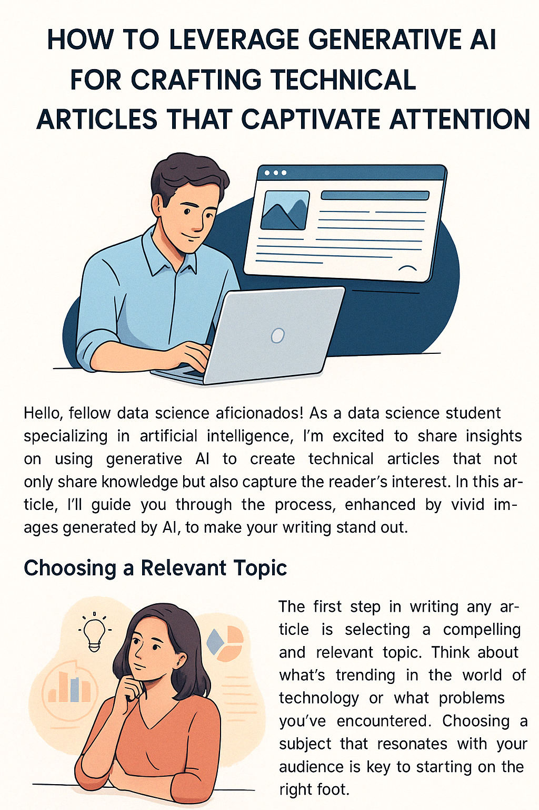
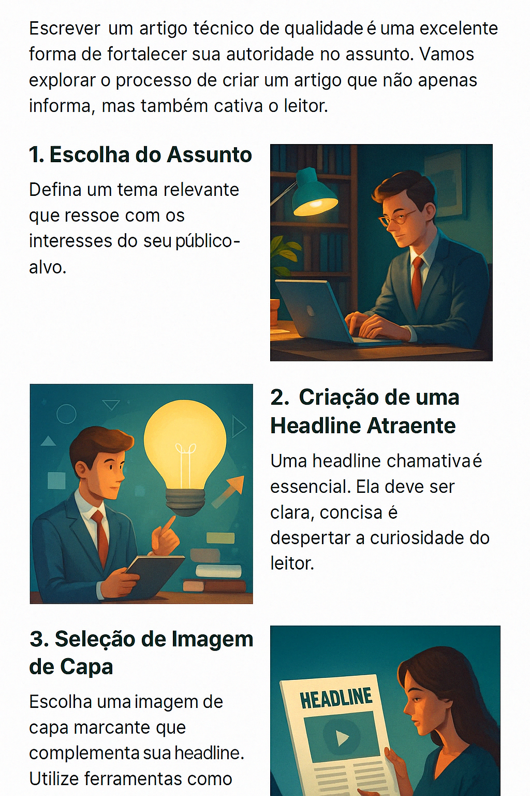

# Projeto: Gerando Artigos Técnicos com IA 🧠✍️
# Project: Generating Technical Articles with AI 🧠✍️

## 📒 Descrição
Este repositório faz parte do desafio da DIO com o objetivo de explorar o uso de **IA Generativa** na produção de **conteúdo técnico de qualidade**. Como estudante de Ciência de Dados, estou cada vez mais mergulhado no universo das inteligências artificiais e acredito que compartilhar conhecimento é uma das formas mais poderosas de consolidar aprendizados e criar autoridade na área.

Neste projeto, usei prompts otimizados no **ChatGPT** para criar um artigo magnético e bem estruturado, com apoio visual gerado por IA através da plataforma **Lexica.art**. Aqui você encontra:
- O **artigo completo** gerado com IA;
- Os **prompts utilizados**;
- As **imagens criadas com IA**;
- Um modelo replicável para futuras publicações.

## 📒 Description
This repository is part of the DIO challenge, aiming to explore the use of **Generative AI** in producing **high-quality technical content**. As a Data Science student, I am increasingly immersed in the universe of artificial intelligence and believe that sharing knowledge is one of the most powerful ways to consolidate learning and build authority in the field.

In this project, I used optimized prompts in **ChatGPT** to create a magnetic and well-structured article, with visual support generated by AI through the **Lexica.art** platform. Here you will find:
- The **complete article** generated with AI;
- The **prompts used**;
- The **images created with AI**;
- A replicable model for future publications.

## 🧠 Tema do Artigo
**"Como a Inteligência Artificial está Transformando a Carreira dos Cientistas de Dados"**

## 🧠 Article Theme
**"How Artificial Intelligence is Transforming the Career of Data Scientists"**

## 📰 Headline
> *Descubra como ferramentas de IA estão acelerando processos, otimizando modelos e mudando a forma como cientistas de dados trabalham (e pensam).* 🔍

## 📰 Headline
> *Discover how AI tools are accelerating processes, optimizing models, and changing the way data scientists work (and think).* 🔍

## 📄 Artigo Completo
## 📄 Full Article

### Introdução
Nos últimos anos, a Inteligência Artificial (IA) deixou de ser apenas uma promessa futurista para se tornar uma aliada indispensável no cotidiano de muitos profissionais — especialmente os cientistas de dados. Ferramentas baseadas em IA estão otimizando fluxos de trabalho, automatizando tarefas repetitivas e até sugerindo soluções criativas para problemas complexos.

### Introduction
In recent years, Artificial Intelligence (AI) has ceased to be just a futuristic promise to become an indispensable ally in the daily lives of many professionals — especially data scientists. AI-based tools are optimizing workflows, automating repetitive tasks, and even suggesting creative solutions to complex problems.

### Ferramentas que Estão Fazendo a Diferença
Hoje, ferramentas como **ChatGPT**, **GitHub Copilot**, **Lexica.art** e **AutoML** estão mudando drasticamente a forma como operamos em projetos de dados. Com elas, é possível gerar códigos, revisar pipelines, documentar experimentos e até criar apresentações visuais com apenas alguns comandos bem elaborados (prompts).

### Tools That Are Making a Difference
Today, tools like **ChatGPT**, **GitHub Copilot**, **Lexica.art**, and **AutoML** are drastically changing how we operate in data projects. With them, it's possible to generate code, review pipelines, document experiments, and even create visual presentations with just a few well-crafted commands (prompts).

### Um Novo Perfil Profissional
O cientista de dados de hoje já não é apenas um analista técnico. Ele é, também, um bom engenheiro de prompts. Saber conversar com um modelo de linguagem, entender suas limitações e aproveitar ao máximo seu potencial virou habilidade essencial no portfólio de quem quer se destacar no mercado.

### A New Professional Profile
Today's data scientist is no longer just a technical analyst. They are also a good prompt engineer. Knowing how to communicate with a language model, understanding its limitations, and making the most of its potential has become an essential skill in the portfolio of those who want to stand out in the market.

### Na Prática
Como estudante de Ciência de Dados, tenho incorporado IAs generativas no meu dia a dia. Utilizo o ChatGPT para revisar conceitos, gerar explicações e até estruturar projetos. Já usei o Lexica.art para criar imagens que ilustram apresentações e relatórios. Essas ferramentas não substituem meu raciocínio — elas o potencializam.

### In Practice
As a Data Science student, I have incorporated generative AIs into my daily life. I use ChatGPT to review concepts, generate explanations, and even structure projects. I have used Lexica.art to create images that illustrate presentations and reports. These tools do not replace my reasoning — they enhance it.

### Conclusão
A IA não veio para substituir o cientista de dados, mas para amplificar suas capacidades. O segredo está em saber como utilizar essas ferramentas de forma estratégica e consciente.

### Conclusion
AI did not come to replace the data scientist but to amplify their capabilities. The secret lies in knowing how to use these tools strategically and consciously.

> **Call to Action:** Se você ainda não está explorando o uso da IA na sua jornada de aprendizado ou no seu trabalho, comece hoje mesmo. O futuro já está aqui.

> **Call to Action:** If you are not yet exploring the use of AI in your learning journey or at work, start today. The future is already here.

## 🖼️ Imagens Geradas
As imagens foram criadas com IA no site **[Lexica.art](https://lexica.art)** para ilustrar os principais pontos do artigo.

## 🖼️ Generated Images
The images were created with AI on the **[Lexica.art](https://lexica.art)** website to illustrate the main points of the article.

## 💬 Prompts Utilizados
Todos os prompts utilizados estão documentados no arquivo [`prompts-utilizados.md`](./prompts-utilizados.md), incluindo aqueles para texto, estrutura de artigo e geração de imagens.

## 💬 Prompts Used
All prompts used are documented in the [`prompts-utilizados.md`](./prompts-utilizados.md) file, including those for text, article structure, and image generation.

## 🌐 Referências
- [Repositório base do desafio - Felipe Aguiar](https://github.com/felipeAguiarCode/prompts-for-article-generate-by-ia)
- [Ferramenta de geração de imagem com IA - Lexica.art](https://lexica.art)

## 🌐 References
- [Base challenge repository - Felipe Aguiar](https://github.com/felipeAguiarCode/prompts-for-article-generate-by-ia)
- [AI image generation tool - Lexica.art](https://lexica.art)

---

> "Não basta usar IA. Entenda, explore e compartilhe. É assim que construímos autoridade."

> "It's not enough to use AI. Understand, explore, and share. That's how we build authority."

Feito com curiosidade e café ☕ por um estudante que ama dados e acredita no futuro com IA. #IAnoGitHub

Made with curiosity and coffee ☕ by a student who loves data and believes in the future with AI. #AIonGitHub

## 📋 Descrição

Descreva aqui o conteúdo desta seção.

## 📋 Description

Describe the content of this section here.

## 📦 Instalação

Descreva aqui o conteúdo desta seção.

## 📦 Installation

Describe the content of this section here.

## 💻 Uso

Descreva aqui o conteúdo desta seção.

## 💻 Usage

Describe the content of this section here.

## 📄 Licença

Descreva aqui o conteúdo desta seção.

## 📄 License

Describe the content of this section here.

